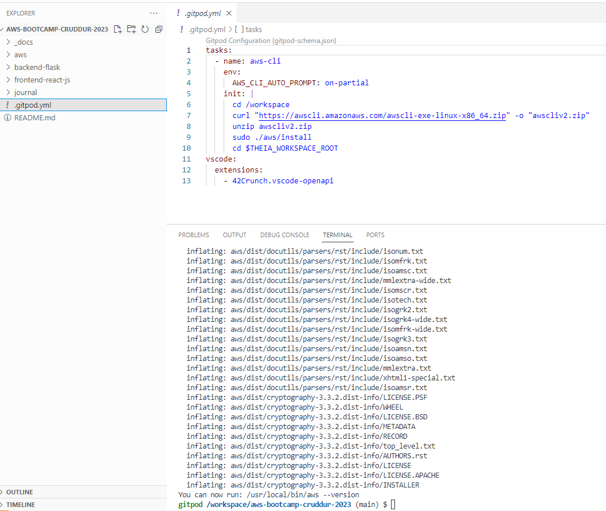
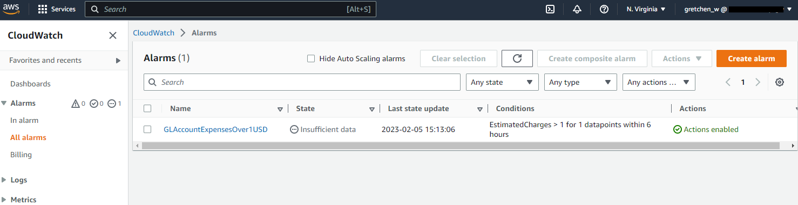
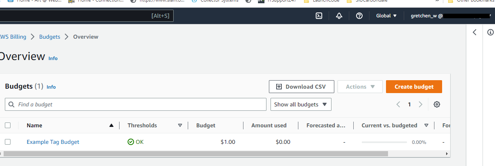

# Week 0 — Billing and Architecture

## Logical Architectural Diagram
### I created this diagram using Lucid Charts.

[Lucid Charts Share Link](https://lucid.app/lucidchart/b53bacd3-70b6-4910-911b-6de123e50245/edit?viewport_loc=-326%2C620%2C2610%2C1254%2C0_0&invitationId=inv_f026d4f8-66bd-44ae-a666-a7307a01b9c8)

## Installed AWS CLI
### I installed the AWS CLI inside Gitpod.

## Create a Billing Alarm
I created a billing alarm using (1) console and (2) CLI/code. The screenshot only displays one alarm because I had to delete the code-based alarm (from bootcamp video). The alarm was switching to "in alarm" state almost immediately and needs to be recofigured. I have yet to determine the adjustment, thus only one alarm is in the screenshot.

[Alarm Code](https://github.com/gwagner-2020/aws-bootcamp-cruddur-2023/commit/da7cebcc7006feea01bdedcfb6bdf8430ae22390)

## Create a Budget
I created a budget using CLI/code.

[Budget Code](https://github.com/gwagner-2020/aws-bootcamp-cruddur-2023/commit/da7cebcc7006feea01bdedcfb6bdf8430ae22390)

## USE BFG to clean Github repo
I used BFG to clean my repo with relatively good results. However, I have outstanding questions about how it functions. For some reason, the sensitive data remains at the "head" of all my commits and is not removed by BFG. Rather, I must physically remove it. Is this the way BFG works? I know it is good practice to physically remove all sensitive data before a repo is deployed, so perhaps BFG is forcing the developer to do it. However, I don't believe the instructor had the issue I encountered. Not clear why it is happening in my repo.